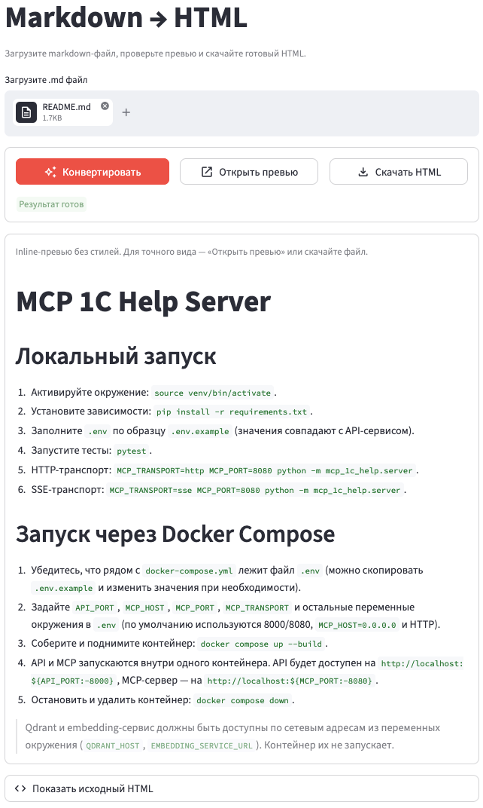

# md-to-html

Сервис конвертации Markdown в самодостаточный HTML (через GitHub API).

Текущая версия: `0.1.1`

Часто нужен адекватно (минималистично) выглядящий HTML из Markdown. HTML получем через открытый API GitHub, а стили просто захардкожены в шаблоне.



GITHUB_TOKEN не нужен, если не требуется массовая (поточная) конвертация. Но если нужно, то его можно передать через переменную окружения при запуске.

Есть два интерфейса:

- FastAPI на `http://localhost:8000`
- Streamlit UI на `http://localhost:8501`

## Локальный запуск

```bash
uv venv .venv
source .venv/bin/activate
uv pip install -r requirements.txt
uvicorn app.api:app --reload
streamlit run app/streamlit_app.py
```

CLI сохранился:

```bash
python3 md_to_html.py /path/to/file.md
```

## Docker

```bash
docker build -t md-to-html .
docker run --rm -p 8000:8000 -p 8501:8501 -e GITHUB_TOKEN=your_token md-to-html
```

## API

`POST /convert`

```bash
curl -X POST http://localhost:8000/convert \
  -H 'Content-Type: application/json' \
  -d '{"markdown":"# Hello"}'
```

`GET /health`

```bash
curl http://localhost:8000/health
```

`GET /version`

```bash
curl http://localhost:8000/version
```

## Релизы

Проект использует Semantic Versioning. Текущая версия хранится в файле `VERSION`, история изменений ведётся в `CHANGELOG.md`.

Чтобы выпустить релиз:

```bash
git add VERSION CHANGELOG.md
git commit -m "Release v0.1.1"
git tag v0.1.1
git push origin main --tags
gh release create v0.1.1 --notes-file CHANGELOG.md
```

После публикации релиза GitHub Actions автоматически собирает Docker-образ и публикует его в GitHub Container Registry:

```bash
docker pull ghcr.io/fserg/md-to-html:v0.1.1
```
